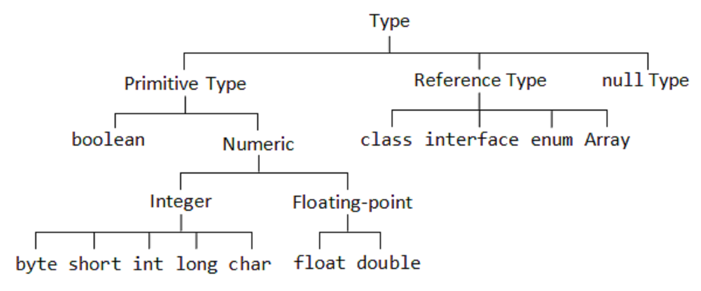

# Tipi di dato primitivi


* In un linguaggio ad oggetti puro, vi sono solo classi e istanze di classi:
* i dati dovrebbero essere definiti sotto forma di oggetti



## Java definisce alcuni tipi primitivi

* Per efficienza Java definisce tipi primitivi
* La dichiarazione di una istanza alloca spazio in memoria
* Un valore è associato direttamente alla variabile 
* (e.g, i == 0) 
* Ne vengono definiti dimensioni e codifica
* Rappresentazione indipendente dalla piattaforma


---


## Tabelle riassuntive: tipi di dato 

**Primitive Data Types**

 | type    | bits       |
 | ------- | ---------- |
 | byte    | 8 bit     |
 | short   | 16 bit    |
 | int     | 32 bit    |
 | long    | 64 bit    |
 | float   | 32 bit    |
 | double  | 64 bit    |
 | char    | 16 bit    |
 | boolean | true/false |

**I caratteri sono considerati interi**

---


###  I tipi numerici, i char

*  Esempi
* `123` (int)
* `256789L ` (L o l = long)
* `0567` (ottale) `0xff34` (hex)
* `123.75 0.12375e+3 `(float o double)
* `'a' '%' '\n'` (char)
* `'\123'` (\ introduce codice ASCII)


### Tipo boolean

* `true`
* `false`


## Esempi

```java
int i = 15;
long longValue = 1000000000000l;
byte b = (byte)254;

float f = 26.012f;
double d = 123.567;
boolean isDone = true;
boolean isGood = false;
char ch = 'a';
char ch2 = ';';
```

---


```java

public class Applicazione {

	public static void main(String[] args) {

		//1) dichiarazione
		int mioNumero;
		//2) inizializzazione
		mioNumero = 100;
		//3) uso della variabile locale
		System.out.println(mioNumero);
		
		//dichiarazione e inizializzazione contemporanea
		short mioShort = 851;
		System.out.println(mioShort);
		
		long mioLong = 34093L;
		System.out.println(mioLong);
		
		double mioDouble = 3.14159732;
		System.out.println(mioDouble);
		
		float mioFloat = 324.4f;
		System.out.println(mioFloat);
		
		char mioChar = 'y';
		System.out.println(mioChar);
		
		boolean mioBoolean = true;
		System.out.println(mioBoolean);
		
		byte mioByte = 127;
		System.out.println(mioByte);
	}

}
```


[Esempi gist](https://gist.github.com/maboglia/c9a5959d663b1e3cdf5f89a152cfe6e3)


[Everything you'll ever need to work with Java primitive types!](https://github.com/deletescape/Primitives)