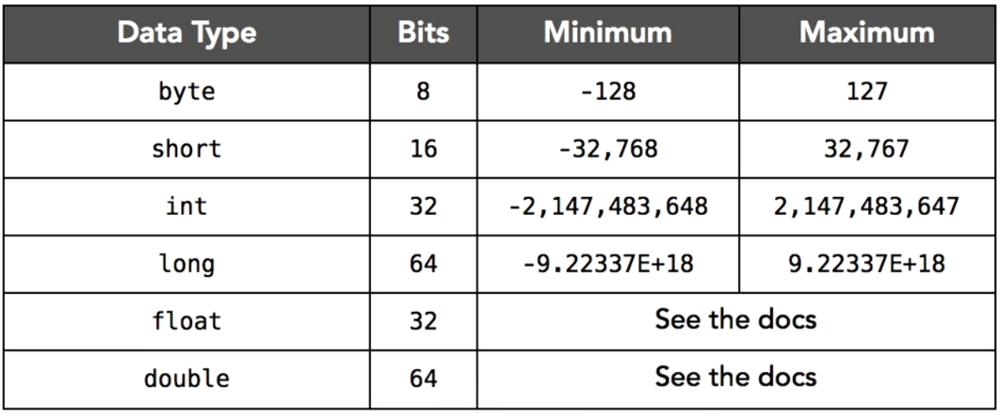

# Tipi di dato primitivi




## Tipo primitivo

### In un linguaggio ad oggetti puro i dati dovrebbero essere definiti sotto forma di oggetti

### Per efficienza
* Java definisce dati primitivi
* La dichiarazione di una istanza (variabile) alloca spazio
* Un valore è associato direttamente alla variabile 
* (e.g, i == 0) 

### Ne vengono definiti dimensioni e codifica

### Rappresentazione indipendente dalla piattaforma

## Tipi primitivi
* boolean
* char
* byte
* short
* int
* long
* float
* double


* void


###  I tipi numerici, i char e le stringhe seguono la sintassi C

*  Esempi
123 (int)
256789L (L o l = long)
0567 (ottale) 0xff34 (hex)
123.75 0.12375e+3 (float o double)
'a' '%' '\n'
'\123' (\ introduce codice ASCII)
"1" "prova\n"

### Tipo boolean
* Esempi
true
false


### In un mondo OO ideale, vi sono solo
classi e istanze di classi

### Java
* Per efficenza usa tipi primitivi per int,
float etc.
* Per completezza
  * Definisce anche classi per interi, float etc.
(classi wrapper)
  * Definisce operazioni per passare dai dati
primitivi alle classi wrapper
Classi "Wrapper" per tipi Primitivi

### Se si vogliono trattare anche i dati
primitivi come oggetti si possono
utilizzare le classi "wrapper"

### Un oggetto di una classe "wrapper"
incorpora un dato primitivo e fornisce
metodi per operare su di esso

### Le classi wrapper dei tipi primitivi sono
definite nel package java.lang


### Corrispondenza

| Tipo Primitivo | ClasseWrapper |
| -------------- | ------------- |
| boolean        | Boolean       |
| char           | Character     |
| byte           | Byte          |
| short          | Short         |
| int            | Integer       |
| long           | Long          |
| float          | Float         |
| double         | Double        |
| void           | Void          |


## Examples

```java
int i = 15;
long longValue = 1000000000000l;
byte b = (byte)254;

float f = 26.012f;
double d = 123.567;
boolean isDone = true;
boolean isGood = false;
char ch = 'a';
char ch2 = ';';
```

```java

public class Application {

	public static void main(String[] args) {//here we learn about primitive types of variables!
		int myNumber;//initialize variable that is an integer
		myNumber = 100;//assign variable
		System.out.println(myNumber);//print variable's value
		short myShort = 851;//for shorter numbers
		System.out.println(myShort);
		long myLong = 34093;//for longer numbers
		System.out.println(myLong);
		double myDouble = 3.14159732;//for extra precision
		System.out.println(myDouble);
		float myFloat = 324.4f;//point variables
		System.out.println(myFloat);
		char myChar = 'y';//single characters with single quotes unlike strings!
		System.out.println(myChar);
		boolean myBoolean = true;//booleans
		System.out.println(myBoolean);
		byte myByte = 127;//only 8 bits of data
		System.out.println(myByte);
	}

}
```

[Everything you'll ever need to work with Java primitive types!](https://github.com/deletescape/Primitives)