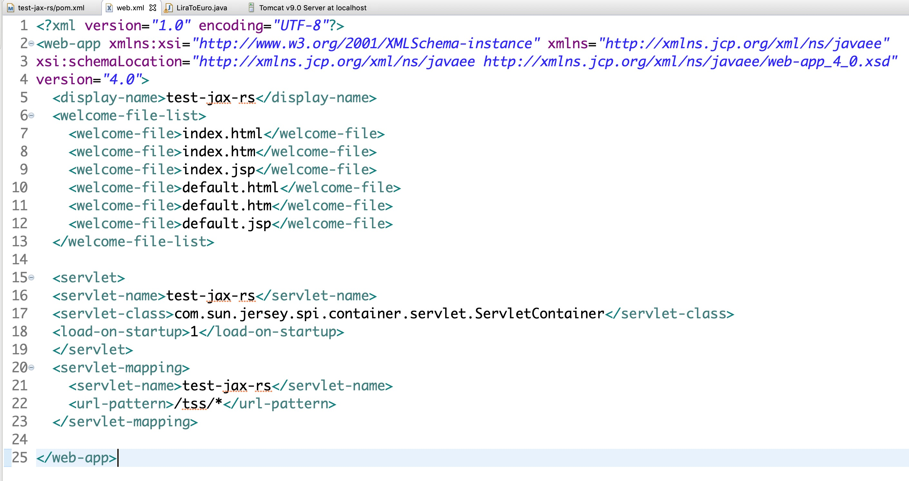
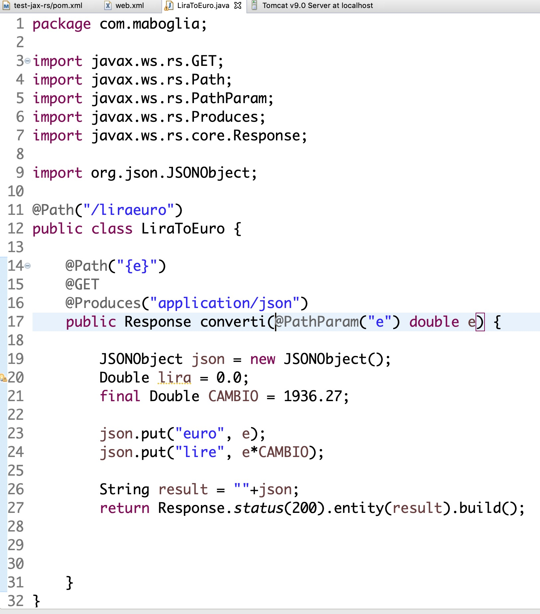
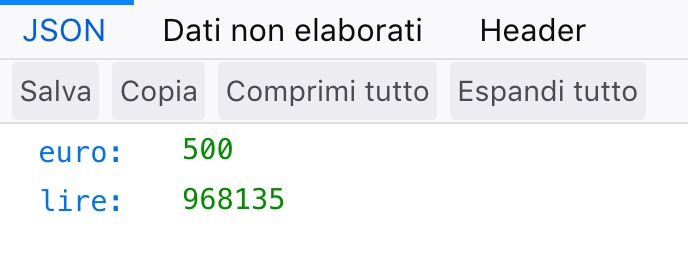

# 1. Java Jax-RS
## 1.1. esercizio convertitore euro-lire

## 1.2. Crea un progetto dynamic web con eclipse
## 1.3. Verifica la presenza di web.xml, atrimenti crealo
## 1.4. right-click->configure->converti a maven project
## 1.5. aggiugni al pom le dipendenze
   * asm
   * jearsey-bundle
   * jearsey-core
   * jearsey-server
   * json




```xml
<project xmlns="http://maven.apache.org/POM/4.0.0" xmlns:xsi="http://www.w3.org/2001/XMLSchema-instance" xsi:schemaLocation="http://maven.apache.org/POM/4.0.0 http://maven.apache.org/xsd/maven-4.0.0.xsd">
  <modelVersion>4.0.0</modelVersion>
  <groupId>test-jax-rs</groupId>
  <artifactId>test-jax-rs</artifactId>
  <version>0.0.1-SNAPSHOT</version>
  <packaging>war</packaging>
  <build>
    <sourceDirectory>src</sourceDirectory>
    <plugins>
      <plugin>
        <artifactId>maven-compiler-plugin</artifactId>
        <version>3.8.0</version>
        <configuration>
          <source>1.8</source>
          <target>1.8</target>
        </configuration>
      </plugin>
      <plugin>
        <artifactId>maven-war-plugin</artifactId>
        <version>3.2.1</version>
        <configuration>
          <warSourceDirectory>WebContent</warSourceDirectory>
        </configuration>
      </plugin>
    </plugins>
  </build>
  <dependencies>
  	<dependency>
  		<groupId>asm</groupId>
  		<artifactId>asm</artifactId>
  		<version>3.3.1</version>
  	</dependency>
  	<dependency>
  		<groupId>com.sun.jersey</groupId>
  		<artifactId>jersey-bundle</artifactId>
  		<version>1.19.4</version>
  	</dependency>
  	<dependency>
  		<groupId>org.json</groupId>
  		<artifactId>json</artifactId>
  		<version>20151123</version>
  	</dependency>
  	<dependency>
  		<groupId>com.sun.jersey</groupId>
  		<artifactId>jersey-server</artifactId>
  		<version>1.19.4</version>
  	</dependency>
  	<dependency>
  		<groupId>com.sun.jersey</groupId>
  		<artifactId>jersey-core</artifactId>
  		<version>1.19.4</version>
  	</dependency>
  </dependencies>
</project>
```
## 1.6. aggiungi al web xml il collegamento a jersey

```xml
  <servlet>
  <servlet-name>test-jax-rs</servlet-name>
  <servlet-class>com.sun.jersey.spi.container.servlet.ServletContainer</servlet-class>
  <load-on-startup>1</load-on-startup>
  </servlet>
  <servlet-mapping>
  	<servlet-name>test-jax-rs</servlet-name>
  	<url-pattern>/tss/*</url-pattern>
  </servlet-mapping>
```
## 1.7. crea una classe java



```java
package com.maboglia;

import javax.ws.rs.GET;
import javax.ws.rs.Path;
import javax.ws.rs.PathParam;
import javax.ws.rs.Produces;
import javax.ws.rs.core.Response;

import org.json.JSONObject;

@Path("/liraeuro")
public class LiraToEuro {

	@Path("{e}")
	@GET
	@Produces("application/json")
	public Response converti(@PathParam("e") double e) {
		
		JSONObject json = new JSONObject();
		Double lira = 0.0;
		final Double CAMBIO = 1936.27;
		
		json.put("euro", e);
		json.put("lire", e*CAMBIO);
		
		String result = ""+json;
		return Response.status(200).entity(result).build();
		
				
		
	}
}

```
## 1.8. build con maven->build->goals->clean install
## 1.9. carica su tomcat e lancia il server
## 1.10. punta su http://localhost:8080/test-jax-rs/tss/liraeuro/500
## 1.11. risponde un json col valore in lire



